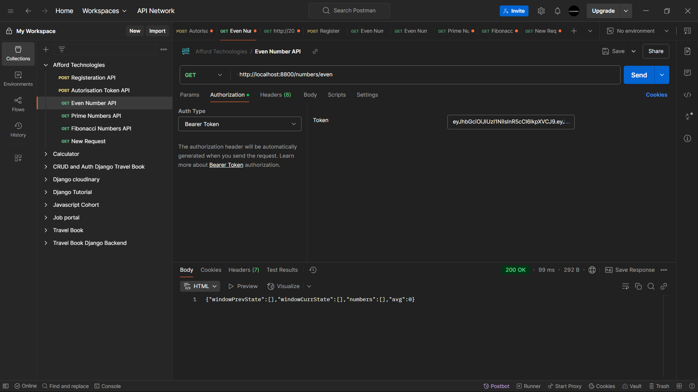
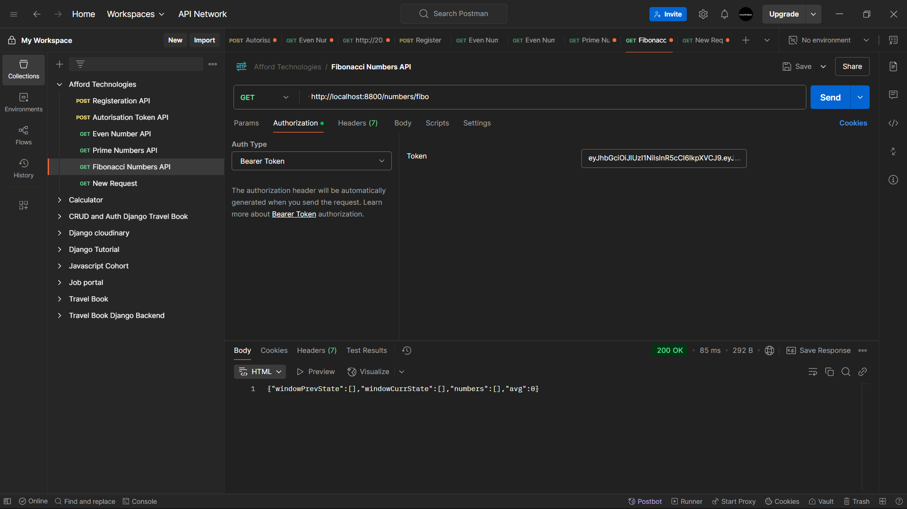
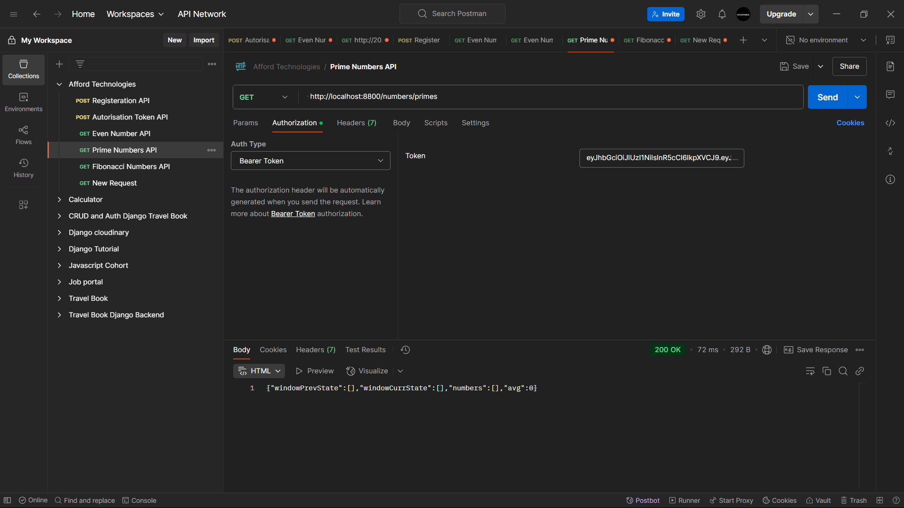
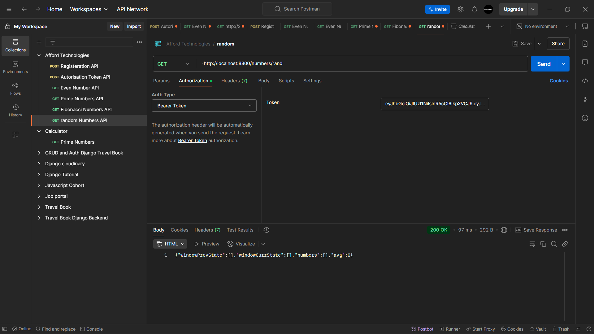

# Pre-requisites:
Clone the repo to your local machine
Make sure you have Nodejs installed on your local environment
## Install the required packages such as express and axios through terminal

```
npm install express axios
```

## Then on terminal, write the below command
```
node index.js
```

# Output Screenshots

## Even Number API


## Fibonacci Number API


## Prime Number API


## Random Number API

